<style type="text/css">
body, td {
   font-size: 22px;
}
code.r{
  font-size: 12px;
}
pre {
  font-size: 22px
}
</style>
---

# Vibrações

Para compreendermos o fenômeno de oscilações, é interessante notar algumas estruturas macroscópicas ou microscópicas que *vibram* (oscilam) conforme Figuras \@ref(fig:ex1-vibracao),\@ref(fig:ex2-vibracao), \@ref(fig:ex3-vibracao) e \@ref(fig:ex4-vibracao):

```{r ex1-vibracao, echo=FALSE, fig.cap='Modo de torção da Ponte Tacoma.', out.width='45%', fig.align='center' }
 
```


```{r ex2-vibracao, echo=FALSE, fig.cap='Ondas de Flexão nas cordas.', out.width='45%', fig.align='center' }
 
```

```{r ex3-vibracao, echo=FALSE, fig.cap='Modos de vibrações de uma molécula.', out.width='45%', fig.align='center' }
 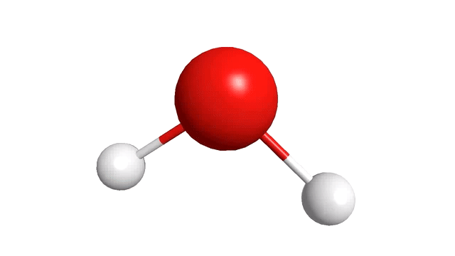
```

```{r ex4-vibracao, echo=FALSE, fig.cap='Modo de vibração de uma menbrana.', out.width='45%', fig.align='center' }
 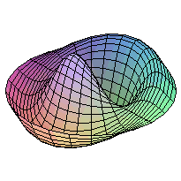
```

---

## Noções de Cálculo 

Antes de apresentarmos a **equação diferencial de um oscilador linear simples**, é importante apresentarmos os conceitos básicos de **derivadas** do **Cálculo I**. Com base na Figura \@ref(fig:ex1-derivada), observamos dois efeitos de transformação causados na função **"grãos de café (Polinômios $x^n$)"** com $n\geq 1$:

```{r ex1-derivada, echo=FALSE, fig.cap='Efeitos observados da derivada de funções polinomiais.', out.width='45%', fig.align='center' }
 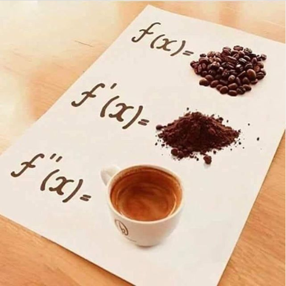
```

É interessante notar que a Figura \@ref(fig:ex1-derivada), nos dá uma noção que uma função vai sendo **transformada**, a medida que usamos os operadores diferenciais $f'(x)$, $f''(x)$ para uma determinada função. Porém a divertida Figura \@ref(fig:ex2-derivada) acaba nos surpreendendo:

```{r ex2-derivada, echo=FALSE, fig.cap='Derivada de uma exponencial.', out.width='45%', fig.align='center' }
 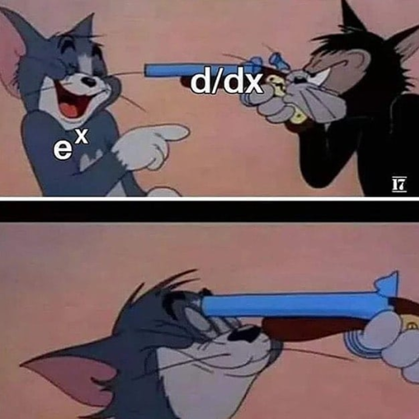
```

Com ela, podemos perceber que o **operador diferencial** não terá nenhum efeito de **transformação** sobre a função exponencial $e^x$. Já que citamos a **função exponencial**, antes de deduzirmos a equação dinâmica do oscilador, apresentaremos a célebre **Fórmula de Euler** expressa por:

$$
x(t) = e^{i\omega t } = \cos{\omega t} + i\sin{\omega t} 
\tag{1}
\label{eq:1}
$$
A Eq$\eqref{eq:1}$ é importante, pois como será visto adiante, ela é uma das solução da **EDO (Equação Diferencial Ordinária) do Oscilador Linear Simples**, e também é importante ter em mente a conexão entre a **função complexa** e as **funções trigonométricas**. A função $e^{i\omega t }$ é uma **função complexa** com <span style="color:red">**parte imaginária** </span> definida por <span style="color:red">$\Im [x(t)] = i\sin \omega t$ </span> e <span style="color:blue">**parte real** </span> definida por <span style="color:blue"> $\Re [x(t)] = \cos \omega t$ </span>. 

A **Fórmula de Euler** pode ser mais intuitiva de ser imaginada, através da animação da Figura \@ref(fig:ex3-complex) :
```{r ex3-complex, echo=FALSE, fig.cap='Movimento Circular no Plano Complexo.[[5]](#5)', out.width='75%', fig.align='center' }
 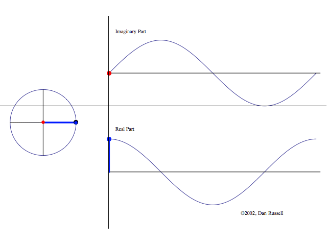
```
Uma das belezas por traz da Eq$\eqref{eq:1}$, está na simplicidade de suas derivadas, pois a primeira derivada é expressa por:
$$
\frac{d(e^{i\omega t})}{dt} = i \omega e^{i\omega t }
\tag{2.1}
\label{eq:2.1}
$$
uma vez que $i^2=-1$, podemos definir a segunda derivada por:
$$
\frac{d^2(e^{i\omega t})}{dt^2} = (i \omega)^2 e^{i\omega t } = -\omega^2 e^{i\omega t }  
\tag{2.2}
\label{eq:2.2}
$$
Se estamos interessados apenas na **parte real** [$\Re$] das Eqs$\eqref{eq:1}$,$\eqref{eq:2.1}$ e $\eqref{eq:2.2}$, podemos mostrar que:
$$
x(t) = \Re[e^{i\omega t }] = \cos{\omega t}  
\tag{3.1}
\label{eq:3.1}
$$
$$
v(t) = \Re\left[\frac{d(e^{i\omega t})}{dt}\right] = \Re[i\omega e^{i\omega t}] = -\omega \sin{\omega t}
\tag{3.2}
\label{eq:3.2}
$$
$$
a(t) = \Re\left[\frac{d^2(e^{i\omega t})}{dt^2}\right] = \Re[-\omega^2 e^{i\omega t}] = -\omega^2 \cos{\omega t}
\tag{3.3}
\label{eq:3.3}
$$
Com base nas Eqs$\eqref{eq:3.1}$ e $\eqref{eq:3.3}$ podemos notar a seguinte relação:
$$
a(t) = -\omega^2 x(t)
\tag{4.1}
\label{eq:4.1}
$$
ou ainda:
$$
x(t) = - \frac{a(t)}{\omega^2}
\tag{4.2}
\label{eq:4.2}
$$

# Oscilador Harmônico Simples Livre 

A partir das equações apresentadas acima, temos as ferramentas matemáticas necessárias para entendermos o comportamento de um oscilador harmônico linear simples. Uma vez que esse sistema pode ser representado através da Figura \@ref(fig:ex4-masss-pring):

```{r ex4-masss-pring, echo=FALSE, fig.cap='Movimento de um Oscilador Harmônico Simples.', out.width='60%', fig.align='center' }
 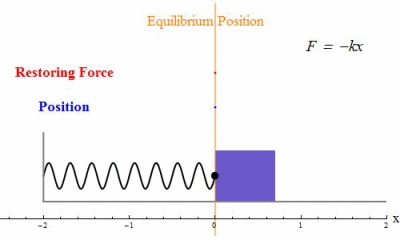
```

A partir da Figura \@ref(fig:ex4-masss-pring), compare o movimento do sistema mola, com a  <span style="color:blue">**parte real**</span> da Figura \@ref(fig:ex3-complex), e você notará um profunda conexão entre o MHS e a função complexa $e^{i \omega t}$!

A **equação diferencial** que define um oscilador harmônico simples é expressa por:     
$$ 
F = ma = -kx
\\
m\frac{d^2x}{dt^2} = -kx 
\\
\frac{d^2x}{dt^2} = -\left(\frac{k}{m}\right)x 
 \tag{5}
 \label{eq:5}
$$  
Ao definirmos a constante da Eq$\eqref{eq:5}$ como:
$$
\omega_0 ^2 = \frac{k}{m}
 \tag{6}
 \label{eq:6}
$$
Substituindo a Eq$\eqref{eq:6}$ na Eq$\eqref{eq:5}$ iremos obter a **EDO de 2 ordem homogenea** de **coeficientes constantes**:
$$ 
\frac{d^2x}{dt^2} +\omega_0 ^2x = 0 
 \tag{7}
 \label{eq:7}
$$  
Note a conexão entre a Eq$\eqref{eq:2.2}$ e a Eq$\eqref{eq:7}$!

Outros sistemas oscilantes idealizados (sem amortecimento) podem ser vistos através da Figura \@ref(fig:ex4-oscilantes):

```{r ex4-oscilantes, echo=FALSE, fig.cap='Sistemas físicos oscilantes [[3]](#3)', out.width='90%', fig.align='center' }
 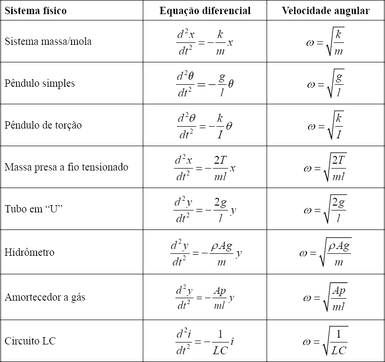
```

Todas as informações necessárias para obtermos as equações dinâmicas como a **função do deslocamento** $x(t) [m]$, **função da velocidade** $v(t) \left[\frac{m}{s}\right]$ e a **função da aceleração** $a(t) \left[\frac{m}{s^2}\right]$  de um oscilador linear simples, já estão prontas! 

Contudo, antes de apresentarmos formalmente essas equações, é importante discutir o significado físico da Eq$\eqref{eq:6}$. 

Começando nos perguntando, por que chamar a razão $k/m$ de $\omega_0 ^2$?

A resposta está diretamente relacionada com a Eq$\eqref{eq:5}$ e a Eq$\eqref{eq:2.2}$! 

Matematicamente falando, notamos que ao derivarmos duas vezes a Eq$\eqref{eq:2.2}$, ela retorna a mesma função multiplicada por uma constante ao quadrado. Esse é o motivo pelo qual usamos a Eq$\eqref{eq:6}$!  

Fisicamente falando, a Eq$\eqref{eq:6}$ nos diz que a **frequência natural** de oscilação de um sistema massa-mola é definido por $\omega_0 = \sqrt {k/m} [rad/s]$. 

Podemos relacionar o periodo de uma oscilação com os parâmetros estruturais $k$ *(rigidez)* e $m$ *(massa)*, através das seguintes equações:

$$
f = \frac{1}{T} [Hz]
 \tag{8}
 \label{eq:8}
$$

$$
\omega_0 = 2 \pi f \left[ \frac{rad}{s} \right]
 \tag{9}
 \label{eq:9}
$$
Ao substituirmos a Eq$\eqref{eq:8}$ na Eq$\eqref{eq:9}$: 
$$
\omega_0 = \frac{2 \pi}{T} \left[ \frac{rad}{s} \right]
 \tag{10}
 \label{eq:10}
$$
Ou podemos reescrever a Eq$\eqref{eq:10}$ como:
$$
T = 2 \pi \sqrt \frac{m}{k} [s]
 \tag{11}
 \label{eq:11}
$$
Com base na Eq$\eqref{eq:11}$ se fixarmos  a *rigidez* em $k = 200 [N/m]$ e calcularmos as masssas para os seguintes Periodos conforme a Tabela 1:

$T_i[s]$ | $m_i [kg]$        
:-------:|:---------:
$2$      | $20.26$  
$3$      | $45.60$  
$6$      | $182.38$ 

A partir da Tabela 1 podemos visualizar a inlfuência das massas em função do Período através da seguinte animação da Figura \@ref(fig:ex5-oscilators):

```{r ex5-oscilators, echo=FALSE, fig.cap='Três Osciladores de diferentes massas e/ou molas.[[5]](#5)', out.width='75%', fig.align='center' }
 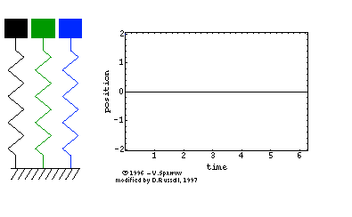
```
Podemos ainda relacionar os parâmetros estruturais*(massa)* e *(mola)* do oscilador com função da frequência, expressa pela Eq$\eqref{eq:12}$:
$$
f = \frac{1}{2 \pi} \sqrt \frac{k}{m} [Hz]
 \tag{12}
 \label{eq:12}
$$
Essa relação pode ser testada através da seguinte simulação representada pela Figura \@ref(fig:ex6-oscilators):

```{r ex6-oscilators, echo=FALSE, fig.cap="Oscilador Linear - [Clique aqui.](https://phet.colorado.edu/sims/resonance/resonance_pt_BR.html)",  out.width='50%', fig.align='center' }
 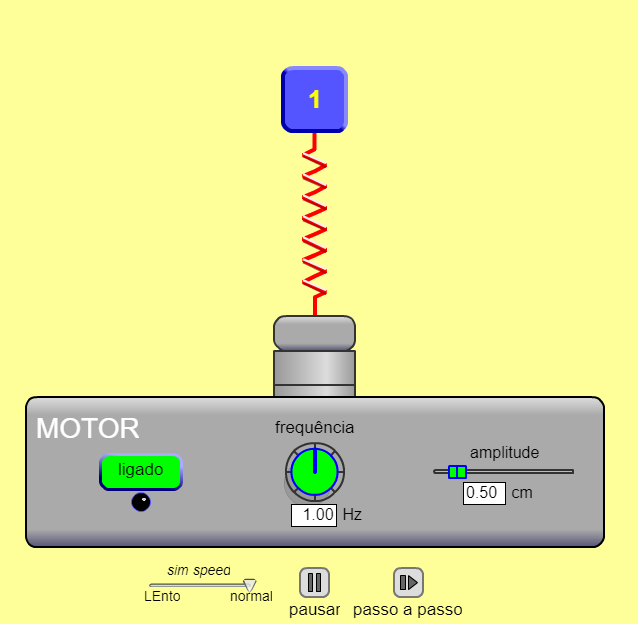
```


Com base no que foi apresentado nas equações anteriores, podemos dizer que a solução geral da **equação dinâmica do deslocamento** $x(t) [m]$ é definida por:
$$
x(t) = \Re[e^{i(\omega_0 t + \phi)}] =  X_0 \cos (\omega_0 t + \phi) [m]
 \tag{13}
 \label{eq:13}
$$
Já para a **equação dinâmica da velocidade** $v(t) \left[ \frac{m}{s} \right]$:
$$
v(t) = \Re[i\omega_0 e^{i(\omega t + \phi)}] =  -\omega_0 X_0 \sin (\omega_0 t + \phi) \left[ \frac{m}{s} \right]
 \tag{14}
 \label{eq:14}
$$
Note que, para a Eq$\eqref{eq:14}$, podemos obter o módulo da **velocidade máxima** $v_{máx}$:
$$
|v_{máx}| = \omega X_0 [m/s] 
 \tag{14.1}
 \label{eq:14.1}
$$
Finalmente, para a **equação dinâmica da aceleração** $a(t) \left[ \frac{m}{s^2} \right]$:
$$
a(t) = \Re[-\omega_0^2 e^{i(\omega t + \phi)}] =  -\omega_0^2 X_0 \cos (\omega_0 t + \phi) \left[ \frac{m}{s^2} \right]
 \tag{15}
 \label{eq:15}
$$
onde o módulo da **aceleração máxima** $a_{máx}$ da Eq$\eqref{eq:15}$ é definida por:
$$
|a_{máx}| = \omega^2 X_0 [m/s^2]
 \tag{15.1}
 \label{eq:15.1}
$$
Observa-se que $X_0 [m]$ é definido como a **amplitude** da oscilação, $\omega_0 [rad/s]$ é a **frequência angular** ou **frequência natural** do **Oscilador Harmônico Simples**, e $\phi [rad]$ é definido como a **fase** do oscilador. Para compreendermos melhor o efeito da **fase** de uma **função trigonométrica** [Clique aqui](https://www.desmos.com/calculator/l3u8133jwj). Já para o efeito da **amplitude** e do **período** de uma **função trigonométrica** [Clique aqui](https://www.desmos.com/calculator/kihjluohq9).

Um ambiente para simular e verificar o comportamento dos gráficos das **funções dinâmicas** de um Oscilador Harmônico Simples, podem ser conferidas através desse Link [Clique aqui](http://physics.bu.edu/~duffy/semester1/c18_SHM_graphs.html).

É interessante notar que uma outra solução alternativa para a Eq$\eqref{eq:7}$, é propor uma **solução real** dada por:
$$
x(t) = e^{rt}
 \tag{16}
 \label{eq:16}
$$
Ao substituirmos a solução da Eq$\eqref{eq:16}$ na Eq$\eqref{eq:7}$:
$$
(r^2+\omega_0^2)e^{rt}=0
 \tag{17}
 \label{eq:17}
$$
Como não queremos a solução trivial, ou seja $x(t) \neq 0$ então iremos procurar a solução da **equação característica**:
$$
r = \pm i \omega_0
 \tag{18}
 \label{eq:18}
$$
Substituindo as soluções da Eq$\eqref{eq:18}$ na Eq$\eqref{eq:16}$:
$$
x(t) = C_1 e^{i\omega_0 t} + C_2 e^{-i\omega_0 t} 
 \tag{19}
 \label{eq:19}
$$
É interessante notar que, pelo principio da **superposição de soluções** para **EDOs homogeneas de 2º ordem** com coeficentes constantes, se $x_1(t)$ e $x_2(t)$ são soluções, então $x_1(t) + x_2(t)$ também será solução. Isso é exatamente o que está sendo apresentado pela Eq$\eqref{eq:19}$. 

Continuando com sua solução, podemos apresentar a Eq$\eqref{eq:19}$ como uma combinação de funções trigonométricas, usando novamente **fórmula de Euler**:
$$
x(t) = C_1 e^{i\omega_0 t} + C_2 e^{-i\omega_0 t}
\\
x(t) = C_1(\cos (\omega_0 t) +i \sin (\omega_0 t)) + C_2(\cos (\omega_0 t) -i \sin (\omega_0 t))
\\
x(t) = (C_1 + C_2)\cos (\omega_0 t) + i (C_1 - C_2)\sin (\omega_0 t)
\\
x(t) = D_1 \cos (\omega_0 t) + D_2 \sin (\omega_0 t)
 \tag{20}
 \label{eq:20}
$$
Usando a identidade trigonométrica da Eq$\eqref{eq:13}$ podemos demonstrar que sua solução será similar a Eq$\eqref{eq:20}$, através das seguintes relações entre as suas constantes:
$$
X_0 \cos (\omega_0 t +\phi) = X_0 \cos(\omega_0 t)\cos(\phi)-X_0 \sin(\omega_0 t)\sin(\phi)
\\
(X_0 \cos(\phi)) \cos(\omega_0 t) - (X_0\sin(\phi)) \sin(\omega_0 t) = D_1 \cos (\omega_0 t) + D_2 \sin (\omega_0 t)
\\
D_1 = X_0 \cos (\phi)
\\
D_2 = -X_0 \sin (\phi)
 \tag{21}
 \label{eq:21}
$$
Após relacionar as **constantes** $D_1$, $D_2$ e as **condições iniciais** $x(0) = x_0 [m]$ e $\dot x(0) = v_0 [m/s]$, a partir da Eq$\eqref{eq:20}$ podemos obter o valor da constante $D_1$:
$$
x(0) = D_1 = x_0
 \tag{22}
 \label{eq:22}
$$
Já para determinarmos a constante $D_2$:
$$
\dot x(t) = \omega_0 (D_2 \cos (\omega_0 t) -  D_1 \sin (\omega_0 t))
\\
\dot x(0) = \omega_0 D_2 = v_0
\\
D_2 = \frac{v_0}{\omega_0}
 \tag{23}
 \label{eq:23}
$$
Substituindo as constante obtidas das Eqs$\eqref{eq:23}$, $\eqref{eq:22}$ na Eq$\eqref{eq:20}$, obtemos a solução da **função do deslocamento** agora em função das condições iniciais:
$$
x(t) = x_0 \cos (\omega_0 t) + \frac{v_0}{\omega_0} \sin (\omega_0 t) [m]
 \tag{24}
 \label{eq:24}
$$
Agora, também iremos reescrever a Eq$\eqref{eq:13}$ em função das **condições iniciais**, pois da relação obtida da Eq$\eqref{eq:21}$:
$$
D_1 = x_0 = X_0 \cos (\phi) \Rightarrow \cos (\phi) = \frac{x_0}{X_0}
\\
D_2 = \frac{v_0}{\omega_0} = - X_0 \sin (\phi) \Rightarrow \sin (\phi) = -\frac{v_0}{X_0 \omega_0}
\\
\cos ^2 (\phi) + sin ^2 (\phi) = 1
\\
\left (\frac{x_0}{X_0} \right)^2 + \left (-\frac{v_0}{X_0 \omega_0} \right)^2 = 1
\\
X_0 ^2 = x_0^2 + \left(\frac{v_0}{\omega_0}\right)^2 
\\
X_0 = \sqrt{x_0^2 +  \left(\frac{v_0}{\omega_0}\right)^2} [m]
\\
\tan (\phi) = \frac{\sin(\phi)}{\cos(\phi)} = -\frac{v_0}{\omega_0 x_0}
\\
\phi(x_0,v_0) = \tan^-1 \left(-\frac{v_0}{\omega_0 x_0}\right) [rad]
\tag{25.1}
\label{eq:25.1}
$$   
É importante notar na Eq$\eqref{eq:25.1}$ que as condições iniciais $x_0 [m]$ e $v_0 [m/s]$ estão em função de $X_0[m]$ e $\omega_0 X_0$ respectivamente, logo:
$$
x_0 (v_0) = \pm \sqrt{X_0^2-\left(\frac{v_0}{\omega_0}\right)^2} [m] 
\tag{25.2.1}
\label{eq:25.2.1}
$$
$$
v_0(x_0) = \pm \omega_0^2 \sqrt{X_0^2-x_0^2}[m/s]
\tag{25.2.2}
\label{eq:25.2.2}
$$
As Eqs$\eqref{eq:25.2.1}$ e $\eqref{eq:25.2.2}$  podem ser visualizadas ao fixarmos $X_0 = 2 [m]$ e $\omega_0 = 5 [rad/s]$ conforme Figuras \@ref(fig:ex5-graf-amp-vel) e \@ref(fig:ex5-graf-vel-amp):

```{r ex5-graf-amp-vel, echo=FALSE, fig.cap= "Gráfico da Eq:25.2.1: $x_0 [m]$ vs $v_0 [m/s]$", out.width='50%',fig.align='center'}
 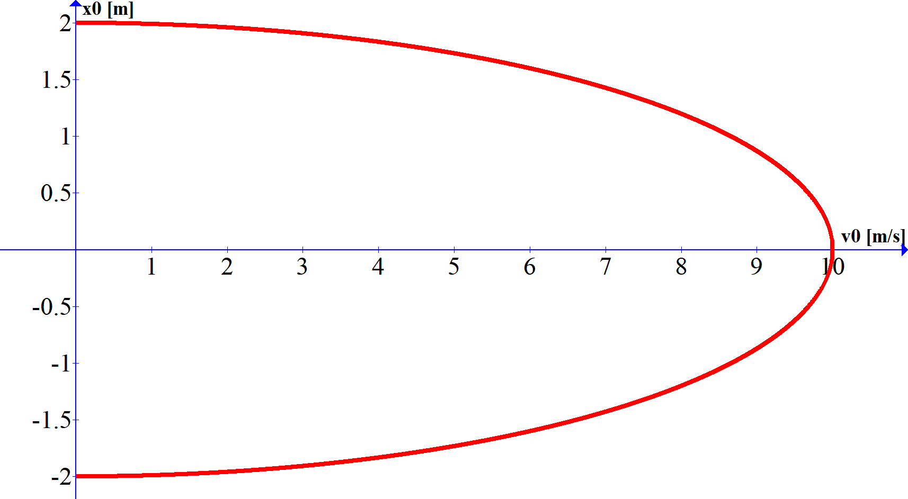
```


```{r ex5-graf-vel-amp, echo=FALSE, fig.cap= "Gráfico da Eq:25.2.2: $v_0 [m/s]$ vs $x_0 [m]$", out.width='70%',fig.align='center'}
 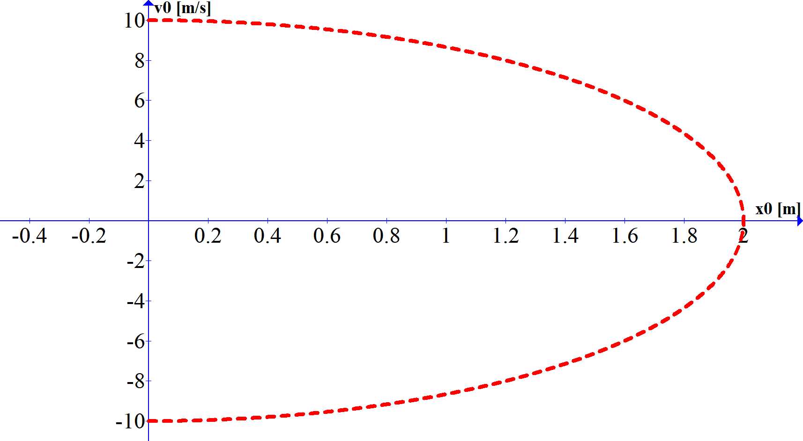
```

Finalmente, com base na Eq$\eqref{eq:25.1}$ podemos reescrever a Eq$\eqref{eq:13}$ como:
$$
x(t) = X_0 \cos(\omega_0 t + \phi)
\\
x(t) = \sqrt{x_0^2 + \left(\frac{v_0}{\omega_0}\right)^2} \cos\left[ (\omega_0 t) + \tan^-1\left( -\frac{v_0}{\omega_0 x_0}\right)\right] [m] 
\\
\tag{26}
\label{eq:26}
$$


## Sistemas Amortecidos

De maneira genérica, podemos caracterizar sistemas amortecidos, através da Figura \@ref(fig:ex4-masss-pring-damping):

```{r ex4-masss-pring-damping, echo=FALSE, fig.cap='Movimento de um Oscilador Harmônico Simples.', out.width='60%', fig.align='center' }
 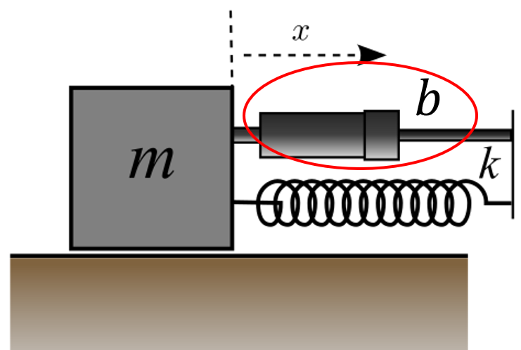
```

Em geral, para qualquer tipo de sistema que use o parâmetro de **amortecimento**, a nova **EDO**, contém uma **força viscosa** definida por $F_{vis} = -bv [N]$, onde a constante de amortecimento $b$, possui unidade $\left[ \frac{N \cdot s}{m} \right]$.

Logo através da *Segunda Lei de Newton*, podemos expressar a **equação de osciladores amortecidos** por:
$$ 
ma = -kx -bv
\\
m\frac{d^2x}{dt^2} = -kx - b\frac{dx}{dt}
\\
\frac{d^2x}{dt^2} + \left(\frac{b}{m}\right)\frac{dx}{dt} +  \left(\frac{k}{m}\right) x = 0 
 \tag{27}
 \label{eq:27}
$$ 
Assim como Eq$\eqref{eq:7}$, a Eq$\eqref{eq:27}$ é definida como uma **EDO de segunda ordem homogenea** com **coeficientes constantes** (parâmetros físicos fixos).

Para determinarmos as possíveis soluções da Eq$\eqref{eq:27}$, iremos simplificar alguns parâmetros:
$$ 
\gamma = \frac{b}{m}  \left[ \frac{1}{s} \right]
\tag{28}
 \label{eq:28}
$$
e:
$$
\omega_0 ^2 =\frac{k}{m} \left[ \frac{1}{s^2} \right]
\tag{29}
 \label{eq:29}
$$  

Substituindo as Eqs$\eqref{eq:29}$ e Eq$\eqref{eq:28}$ na $\eqref{eq:27}$, teremos:
$$
\frac{d^2x}{dt^2} + \gamma\frac{dx}{dt} +  \omega_0 ^2 x = 0 
 \tag{30}
 \label{eq:30}
 $$
Para determinarmos as possíveis soluções da Eq$\eqref{eq:30}$, começaremos analisando o **amortecimento crítico**.

### Amortecimento Crítico

O **amortecimento crítico** é utilizado quando deseja-se que um componente de um sistema físico, volte a sua posição de equilibrio o mais rápido possível após uma perturbação.

Exemplos práticos de aplicações desse tipo de amortecimento, são os **amortecedores de automóveis**, **galvanômetros** ou **balança de precisão**.

Para a solução da Eq$\eqref{eq:30}$ iremos propor, uma **solução real** definida por:

$$
x(t) =  e^{rt}
 \tag{31}
 \label{eq:31}
$$
Ao substituirmos a Eq$\eqref{eq:31}$ na Eq$\eqref{eq:30}$ obteremos:

$$
 (r^2 + \gamma r + \omega_0 ^2) e^{rt} = 0
 \tag{32}
 \label{eq:32}
$$

Como não queremos a **solução trivial**, ou seja $x(t)\neq0$, então iremos resolver a Equação do Segundo grau (**equação auxiliar**) dada pela Eq$\eqref{eq:32}$:
$$
 r^2 + \gamma r + \omega_0 ^2 = 0
 \\
 r = \frac{-\gamma \pm \sqrt{\gamma ^2 -4\omega_0^2}}{2}
 \\
 r = -\frac{\gamma}{2} \pm \sqrt{\left( \frac {\gamma}{2} \right)^2 - \omega_0^2}
 \tag{33}
 \label{eq:33}
$$
Chamando $\beta$:
$$
\beta = \sqrt{\left( \frac {\gamma}{2}\right)^2 - \omega_0^2 }
 \tag{34}
 \label{eq:34}
$$

Substituindo a Eq$\eqref{eq:34}$ na Eq$\eqref{eq:33}$:
$$ 
 r = -\frac{\gamma}{2} \pm \beta
 \tag{35}
 \label{eq:35}
$$
Iremos analisar os **três possíveis casos** para solução da **equação auxiliar**. 

Nos dois casos iniciais (**amortecimento crítico** e **supercrítico**) estaremos supondo que $\beta$ é um **número real**. 

Para o **primeiro caso**, caso particular em que $\beta = 0$, ou seja $\frac{\gamma}{2} = \omega_0$, onde as raízes da **equação auxiliar** são **raizes iguais**, teremos como solução inicial:

$$
x(t) =  e^{-\frac{\gamma t}{2}}
 \tag{36}
 \label{eq:36}
$$
Para satisfazermos a solução de uma **EDO de segunda ordem homogenea** de **coeficientes constantes**, deve-se satisfazer as condições iniciais, definidas por $x(0) = A$ e $\dot x (0) = B$, logo a solução proposta pela Eq$\eqref{eq:31}$, não será suficiente para resolvermos o problemas para as raízes reais iguais. 

Como solução alternativa, iremos propor uma nova solução definida por:
$$
x(t) = w(t) e^{-\frac{\gamma t}{2}}
 \tag{37}
 \label{eq:37}
$$
Ao substituirmos a Eq$\eqref{eq:37}$ na Eq$\eqref{eq:30}$ chegaremos a seguinte solução:
$$
\ddot w(t) e^{-\frac{\gamma t}{2}} = 0
 \tag{38}
 \label{eq:38}
$$
Então para encontrarmos uma solução para Eq$\eqref{eq:38}$:
$$
\ddot w(t) = 0
\\
\dot w(t) = C_1
\\
w(t) = C_1 t + C_2
 \tag{39}
 \label{eq:39}
$$
Logo a solução para o caso em que $\beta=0$ será definida por:
$$
x(t) = (C_1 t + C_2) e^{-\frac{\gamma t}{2}}
 \tag{40}
 \label{eq:40}
$$
Uma forma de entedermos o comportamento do **amortecimento crítico** , é através da observação da Figura \@ref(fig:ex5-masss-pring-damping-critical):

```{r ex5-masss-pring-damping-critical, echo=FALSE, fig.cap='Movimento de um Oscilador Harmônico Simples.', out.width='60%', fig.align='center' }
 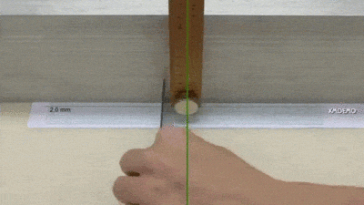 
```
### Amortecimento Supercrítico

Para entendermos o comportamento do **amortecimento supercrítico**, basta utilizarmos o resultado obtido pela **equação auxiliar** da Eq$\eqref{eq:34}$. Contudo, supondo agora que   $\frac{\gamma}{2} > \omega_0$,  as raízes da **equação auxiliar** são **raizes reais** e **distintas**, teremos a seguinte solução:
$$
x(t) = e^{rt} =e^{\left( -\frac{\gamma }{2} \pm \beta \right)t}
\\
x(t) = e^{-\frac{\gamma t}{2}} (C_1 e^{\beta t} +  C_2 e^{-\beta t})
\\
x(t) = C_1 e^{-t\left( \frac{\gamma }{2} - \beta \right )} + C_2 e^{-t\left( \frac{\gamma}{2} + \beta \right )}
 \tag{41}
 \label{eq:41}
$$
O comportamento do **amortecimento supercrítico** pode ser observado através da Biologia molecular, para moléculas e organelas no interior das células.

### Amortecimento Subcrítico

No caso do **sistema amortecido subcrítico** , diferentemente dos dois casos anteriores, onde $\beta > 0$, iremos supor que $\frac {\gamma}{2} < \omega_0$. Logo, reescrevendo a Eq$\eqref{eq:33}$:

$$
 r = -\frac{\gamma}{2} \pm i\sqrt{\omega_0^2 - \left( \frac {\gamma}{2} \right)^2}
 \tag{42}
 \label{eq:42}
$$
Chamando $\omega$:
$$
\omega =  \sqrt{\omega_0^2 - \left( \frac {\gamma}{2} \right)^2}
 \tag{43}
 \label{eq:43}
$$
Substituindo a Eq$\eqref{eq:43}$ na Eq$\eqref{eq:42}$:
$$
 r = -\frac{\gamma}{2} \pm i\omega
 \tag{44}
\label{eq:44}
$$

A nova solução de $x(t)$ será expressa por:
$$
x(t) = e^{rt} =e^{\left( -\frac{\gamma }{2} \pm i\omega \right)t}
\\
x(t) = e^{-\frac{\gamma t}{2}} (C_1 e^{i\omega t} +  C_2 e^{-i\omega t})
 \tag{45}
 \label{eq:45}
$$
Ao utilizarmos os termos compostos pela notação complexa da Eq$\eqref{eq:45}$:
$$
C_1 e^{i\omega t} +  C_2 e^{-i\omega t}
\\
C_1 [\cos{(\omega t)} + i\sin{(\omega t}) ] + C_2 [\cos{(\omega t)} + i\sin{(\omega t}) ]
\\
\cos {(\omega t)} (C_1 + C_2) + i \sin{(\omega t)}(C_1 - C_2)
\\
D_1 \cos{(\omega t)} + D_2 \sin{(\omega t)}
 \tag{46}
 \label{eq:46}
$$
Podemos reescrever a Eq$\eqref{eq:45}$ através da seguinte identidade trigonométrica:
$$
X_0 \cos ({\omega t + \phi}) = X_0 [\cos({\omega t}) \cos({\phi})] - X_0 [\sin({\omega t}) \sin({\phi})]
\\
X_0 \cos({\omega t + \phi}) = (X_0 \cos{\phi})\cos{(\omega t)} - (X_0 \sin{\phi})\sin{(\omega t)} 
\\
D_1 \cos{(\omega t)} + D_2 \sin{(\omega t)} = X_0 \cos{\phi} \cos{(\omega t)} - X_0 \sin{\phi} \sin{(\omega t)} 
 \tag{47}
 \label{eq:47}
$$
Da Eq$\eqref{eq:47}$ podemos concluir que $D_1 = X_0 \cos{\phi}$ e $D2 = -X_0 \sin{\phi}$. Finalmente, substituindo o resultado da Eq$\eqref{eq:46}$ na Eq$\eqref{eq:45}$:
$$
x(t) = e^{-\frac{\gamma t}{2}}(D_1 \cos{(\omega t)} + D_2 \sin{(\omega t)})
 \tag{48.1}
 \label{eq:48.1}
$$
ou na forma encontrada em muitas referências, substitui-se a  Eq$\eqref{eq:48.1}$ na Eq$\eqref{eq:47}$:
$$
x(t) = X_0 e^{-\frac{\gamma t}{2}}\cos({\omega t + \phi})
 \tag{48.2}
 \label{eq:48.2}
$$
Uma maneira de compreendermos o caso do **amortecimento subcrítico**, pode ser visualizado através da Figura \@ref(fig:ex5-masss-pring-damping):

```{r ex5-masss-pring-damping, echo=FALSE, fig.cap='Movimento de um Oscilador Harmônico Simples.', out.width='60%', fig.align='center' }
 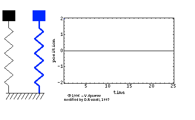
```
Ao analisarmos os três possíveis casos que a Eq$\eqref{eq:27}$ pode oferecer, um resumo para facilitar a classificação do comportamento das oscilações amortecidas, pode ser expresso através da Tabela 2:

Parâmetros Físicos | Parâmetros do sistema        | Comportamento
:-----------------:| :---------------------------:|:-------------
$b = 2\sqrt{m k}$  | $\frac{\gamma}{2}=\omega_0$  | Crítico
$b > 2\sqrt{m k}$  | $\frac{\gamma}{2}>\omega_0$  | Supercrítico
$b < 2\sqrt{m k}$  | $\frac{\gamma}{2}<\omega_0$  | Subamortecido

Uma vez que já possuimos as soluções para os três casos de amortecimento, como base nas Eqs$\eqref{eq:40}$, $\eqref{eq:41}$ e $\eqref{eq:48.1}$, vamos expressar essas **equações dinâmicas** em função das **condições iniciais** $x(0) = x_0 [m]$ e $\dot x(0) = v_0 [m/s]$. 

Começando novamente pelo caso do **amortecimento critico**:
$$
x(t) = (C_1 t + C_2)e^{-\frac{\gamma t}{2}}
\\
x(0) = C_2 = x_0
\tag{49}
 \label{eq:49}
$$
Para determinarmos a constante $C_1$ da Eq$\eqref{eq:49}$:
$$
\dot x = e^{-\frac{\gamma t}{2}} \frac{[C_1(2-\gamma t) - \gamma C_2]}{2}
\\
\dot x(0) = \frac{2 C_1 - \gamma C_2}{2} = v_0
\\
C_1 = v_0 + \frac{\gamma x_0}{2}
\tag{50}
 \label{eq:50}
$$
Substituindo as constantes da Eq$\eqref{eq:50}$ e Eq$\eqref{eq:49}$ na Eq$\eqref{eq:40}$:
$$
x(t) = e^{-\frac{\gamma t}{2}} \left [ \left( v_0 + \frac{\gamma x_0}{2}\right)t + x_0 \right] [m]
\tag{51}
 \label{eq:51}
$$
Já para o caso do **amortecimento supercritico**:
$$
x(t) = C_1 e^{-t\left( \frac{\gamma }{2} - \beta \right )} + C_2 e^{-t\left( \frac{\gamma}{2} + \beta \right )}
\\
x(0) = C_1 + C_2  = x_0
\tag{52}
\label{eq:52}
$$
obtendo a derivada da Eq$\eqref{eq:41}$:
$$
\dot x(t) = -\left( \frac{\gamma }{2} - \beta \right )C_1 e^{-t\left( \frac{\gamma }{2} - \beta \right )} -\left( \frac{\gamma }{2} + \beta \right ) C_2 e^{-t\left( \frac{\gamma}{2} + \beta \right )}
\\
\dot x(0) = -\left( \frac{\gamma }{2} - \beta \right )C_1 -\left( \frac{\gamma }{2} + \beta \right )C_2  = v_0
\tag{53}
\label{eq:53}
$$
Ao montarmos na forma matricial o sitema de equações obtidos pelas Eqs$\eqref{eq:52}$ e $\eqref{eq:53}$:
$$
\begin{bmatrix} 
1 & 1 \\-\left(\frac{\gamma }{2} - \beta\right) & -\left(\frac{\gamma }{2}+\beta\right) 
\end{bmatrix}
\begin{pmatrix} 
C_1 \\ C_2 
\end{pmatrix} = 
\begin{pmatrix} 
x_0 \\ v_0 
\end{pmatrix}
\tag{54}
\label{eq:54}
$$
Como solução para Eq$\eqref{eq:54}$:
$$
\begin{pmatrix} C_1 \\ C_2 
\end{pmatrix} = \frac{1}{2\beta}
\begin{pmatrix}  v_0 + \frac{x_0 (2\beta + \gamma)}{2}  \\ - v_0 + \frac{x_0 (2\beta - \gamma)}{2}    
\end{pmatrix}
\tag{55}
\label{eq:55}
$$

Logo, utilizando as constantes obtidas na Eq$\eqref{eq:55}$ na Eq$\eqref{eq:40}$:
$$
x(t) = \frac{1}{2\beta} \bigg\{ \left[ v_0 + \frac{x_0 (2\beta + \gamma)}{2} \right] e^{-t\left( \frac{\gamma }{2} - \beta \right )} - \left[ v_0 - \frac{x_0 (2\beta - \gamma)}{2} \right] e^{-t\left( \frac{\gamma}{2} + \beta \right )} \bigg\} [m]
\tag{56}
\label{eq:56}
$$
Finalmente para o caso do **amortecimento subcritico** usando a condição inicial $x(0) = x_0 [m]$ na Eq$\eqref{eq:48.1}$:
$$
x(0) = D_1 = x_0
 \tag{57}
 \label{eq:57}
$$
Já para a condição inicial $\dot x(0) = v_0 [m/s]$:
$$
x(t) = e^{-\frac{\gamma t}{2}}(D_1 \cos{(\omega t)} + D_2 \sin{(\omega t)})
\\
\dot x(t) = e^{-\frac{\gamma t}{2}}[(\omega D_2\cos(\omega t) - \omega D_1\sin(\omega t)) -\frac{\gamma}{2}(D_1\cos(\omega t)+D_2 \sin (\omega t))]
\\
\dot x(0) = \omega D_2  -\frac{\gamma x_0}{2} = v_0
\\
D_2 = \frac{2v_0 + \gamma x_0}{2 \omega}
 \tag{58}
 \label{eq:58}
$$
Substituindos os resultados obtidos nas Eqs$\eqref{eq:58}$ e $\eqref{eq:57}$ na Eq$\eqref{eq:48.1}$:
$$
x(t) = e^{-\frac{\gamma t}{2}}[x_0 \cos{(\omega t)} + \left(\frac{2v_0 + \gamma x_0}{2 \omega} \right) \sin{(\omega t)}] [m]
\tag{59.1}
 \label{eq:59.1}
$$
ou:
$$
x(t) = e^{-\frac{\gamma t}{2}}\sqrt{x_0^2 + \left(\frac{2v_0 + \gamma x_0}{2 \omega} \right)^2} \cos\left[ (\omega t) + \tan^-1\left( -\frac{2v_0+\gamma x_0}{2\omega x_0}\right)\right] [m]
\tag{59.2}
\label{eq:59.2}
$$

Supondo as condições inciais dadas por $x(0) = 2 [m]$ e $\dot x(0) = 20 [m/s]$ e fixando o valor da massa $m = 5 [kg]$, podemos satisfazer os três tipos de amortecimentos, através dos seguintes parâmetros da Tabela 3:

|$k_i [N/m]$ |$b_i [Nm/s]$   |$\gamma_i [s^-1]$   |$\omega_{0i}^2 [rad/s]$|Parâmetros do sistema         | Comportamento
|:----------:|:-------------:|:------------------:|:--------------------: | :---------------------------:|:-------------
|$2000$      |$200$          |$40$                |$400$                  | $\frac{\gamma}{2}=\omega_0$  | Crítico
|$1500$      |$300$          |$60$                |$300$                  | $\frac{\gamma}{2}>\omega_0$  | Supercrítico
|$2500$      |$25$           |$5$                 |$500$                  | $\frac{\gamma}{2}<\omega_0$  | Subamortecido

Com base nos parâmetros obtidos na Tabela 3, as **EDOs de 2º ordem homogeneas** com **com coeficientes constantes** são expressas por:
$$
\ddot x_1 + 40\dot x_1 + 400 x_1 = 0,
\tag{60.1}
 \label{eq:60.1}
$$

$$
\ddot x_2 + 60\dot x_2 + 300 x_2 = 0,
\tag{60.2}
 \label{eq:60.2}
$$
$$
\ddot x_3 + 5\dot x_3 + 500 x_3 = 0,
\tag{60.3}
 \label{eq:60.3}
$$
Através das Eqs$\eqref{eq:60.1}$,$\eqref{eq:60.2}$ e $\eqref{eq:60.3}$, suas soluções são expressas respectivamente através da equação do **amortecimento crítico** (solução da Eq$\eqref{eq:60.1}$):
$$
x_1(t) = e^{-20t}(60t+2) [m]
\tag{61.1}
 \label{eq:61.1}
$$
Já para a equação do **amortecimento supercrítico** (solução da Eq$\eqref{eq:60.2}$):
$$
x_2(t) = 2.63e^{-5.51t}-0.63e^{-54.50t} [m]
\tag{61.2}
 \label{eq:61.2}
$$


Finalmente para a equação do **amortecimento subcrítico** (solução da Eq$\eqref{eq:60.3}$) teremos duas formas de apresentar sua solução:
$$
x_3(t) = e^{-2.5t}\left[ 2\cos{(22.22t)} + 1.12\sin(22.22t) \right] [m]
\tag{61.3.1}
 \label{eq:61.3.1}
$$
ou:
$$
x_3(t) = 2.2947e^{-2.5t}\left[\cos{(22.22t)} + \tan^{-1}(-0.5124) \right] [m]
\tag{61.3.2}
 \label{eq:61.3.2}
$$

A partir das Eqs$\eqref{eq:61.1}$,$\eqref{eq:61.2}$ e $\eqref{eq:61.3.1}$ podemos visualizar graficamente os três amortecimentos com base na Figura \@ref(fig:ex10-graf-amortecimento):

```{r ex10-graf-amortecimento, echo=FALSE, fig.cap='Oscilações Amortecidas.', out.width='100%', fig.align='center' }
 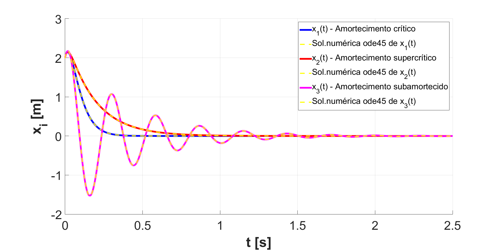  
```
Para uma melhor visualização do comportamento **físico** e **gráfico** das **oscilações livres amortecidas** [Clique aqui](http://physics.bu.edu/~duffy/semester1/c19_damped_sim.html). 

---

# Referências Bibliográficas  

<a id="1">[1]</a> - HALLIDAY, David; RESNICK, Robert; WALKER, Jearl (Coaut. de). Fundamentos de física VOL 2. 8. ed. Rio de Janeiro, RJ: Livros Técnicos e Científicos, 2009. 4v., il. ISBN 9788521616054 (broch.).

<a id="2">[2]</a> - Nussenzveig, Moysés, H. Curso de física básica 5ª Edição (Fluidos, Oscilações, Ondas e Calor).

<a id="3">[3]</a> - Jr., H., Annibal, HETEM, Gregorio, C. Fundamentos de Matemática - Física para Licenciatura - Ondulatória.

<a id="4">[4]</a> - Zill, D. Equações diferenciais: com Aplicações em Modelagem - Tradução da 10ª edição norte-americana. 

<a id="5">[5]</a> - Fonte: Wikpedia (Acessado em 10/02/2019) - [Fórmula de Euler](https://pt.wikipedia.org/wiki/F%C3%B3rmula_de_Euler).

<a id="6">[6]</a> - Fonte: Wikpedia (Acessado em 10/02/2019) - [Identidade de Euler](https://pt.wikipedia.org/wiki/Identidade_de_Euler)

<a id="7">[7]</a> - Fonte: Wikpedia (Acessado em 10/02/2019) - [Harmonic Oscilator](https://en.wikipedia.org/wiki/Harmonic_oscillator)

<a id="8">[8]</a> - Fonte: Daniel A. Russell  (Acessado em 10/02/2019) - [Vibration and Structural Waves](https://www.acs.psu.edu/drussell/demos.html) 

---

# Referências para Simulação  

<a id="9">[9]</a> - [Desmos Graphing](https://www.desmos.com/calculator) 

<a id="10">[10]</a> - [Phet Colorado](https://phet.colorado.edu/pt_BR/simulations/category/physics) 


