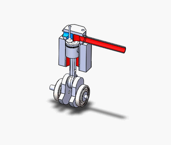
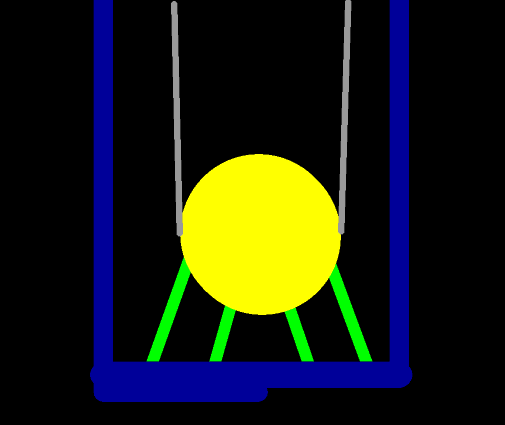
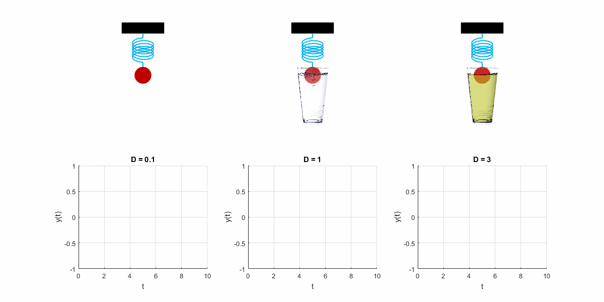
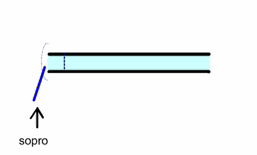
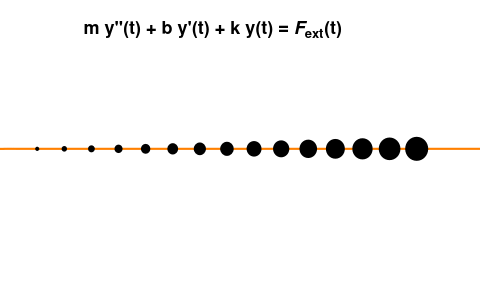
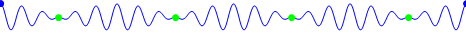
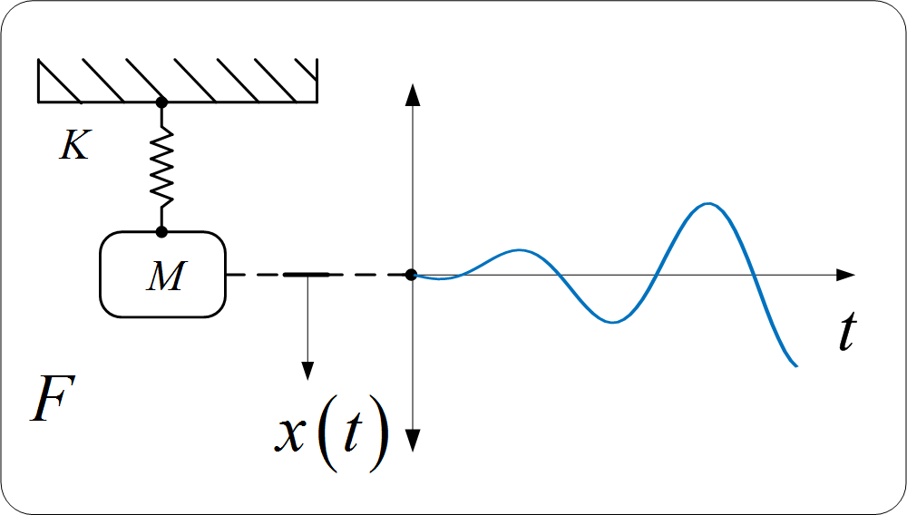
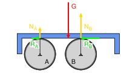

<style type="text/css">
body, td {
   font-size: 22px;
}
code.r{
  font-size: 12px;
}
pre {
  font-size: 22px
}
</style>

---

# Vibrações Forçadas

Na aula anterior, estudamos o comportamento de sistemas que oscilam livremente, após uma perturbação inicial. Agora, vamos analisar o que acontece quando uma **força externa periódica** é aplicada continuamente ao sistema.

Exemplos práticos de vibrações forçadas estão por toda parte conforme as Figuras \@ref(fig:ex1-forcada), \@ref(fig:ex2-forcada), \@ref(fig:ex3-forcada) e \@ref(fig:ex4-forcada):

```{r ex1-forcada, echo=FALSE, fig.cap='Mecanismo de manivela: ilustra como máquinas rotativas convertem movimento circular em força periódica, fonte clássica de vibração forçada.', out.width='45%', fig.align='center'}

```

```{r ex2-forcada, echo=FALSE, fig.cap='Amortecedor de massa sintonizada (TMD) em edifício: o sistema massa-mola-amortecedor controla a resposta estrutural sob excitação dinâmica (sísmica ou vento).', out.width='45%', fig.align='center'}

```

```{r ex3-forcada, echo=FALSE, fig.cap='Oscilador mola-pêndulo com diferentes níveis de amortecimento: representa a resposta de estruturas (pontes, viadutos) sob carregamentos periódicos.', out.width='45%', fig.align='center'}

```

```{r ex4-forcada, echo=FALSE, fig.cap='Tubo acústico aberto em ressonância: a coluna de ar vibra em sua frequência natural quando excitada — princípio análogo ao ressonador de Helmholtz.', out.width='45%', fig.align='center'}

```

---

## Revisão: Superposição de Soluções

Antes de deduzirmos a resposta do oscilador forçado, precisamos relembrar um resultado fundamental das **EDOs de 2ª ordem não-homogêneas**.

Para uma EDO da forma:

$$
\frac{d^2x}{dt^2} + p(t)\frac{dx}{dt} + q(t)x = f(t)
\tag{1}
\label{eq:1}
$$

A **solução geral** é obtida pela **superposição**:

$$
x(t) = \underbrace{x_h(t)}_{\text{Solução homogênea}} + \underbrace{x_p(t)}_{\text{Solução particular}}
\tag{2}
\label{eq:2}
$$

onde:

- $x_h(t)$ é a solução da equação **homogênea** associada (com $f(t) = 0$), que representa a **resposta transiente** — ela decai com o tempo em sistemas amortecidos.
- $x_p(t)$ é qualquer solução particular que satisfaça a equação **completa** com $f(t) \neq 0$, que representa a **resposta estacionária** — ela persiste indefinidamente.

Fisicamente, a Eq$\eqref{eq:2}$ nos diz que o sistema responde ao mesmo tempo à sua **condição inicial** (transiente) e à **força aplicada** (estacionária). Com o tempo, o transiente desaparece e resta apenas a resposta estacionária, conforme será visto adiante.

---

# Oscilador Forçado Sem Amortecimento

## Equação de Movimento

Considere o sistema massa-mola da Figura \@ref(fig:ex5-sistema-forcado), agora submetido a uma força harmônica externa $F(t) = F_0 \cos(\omega t)$ [N]:

```{r ex5-sistema-forcado, echo=FALSE, fig.cap='Sistema massa-mola com excitação harmônica externa $F(t) = F_0\\cos(\\omega t)$.', out.width='60%', fig.align='center'}

```

Aplicando a **Segunda Lei de Newton** ao sistema da Figura \@ref(fig:ex5-sistema-forcado):

$$
F = ma
\\
F_0 \cos(\omega t) - kx = m\frac{d^2x}{dt^2}
\\
m\frac{d^2x}{dt^2} + kx = F_0 \cos(\omega t)
\tag{3}
\label{eq:3}
$$

Dividindo a Eq$\eqref{eq:3}$ por $m$ e usando a definição $\omega_0^2 = k/m$ da aula anterior:

$$
\frac{d^2x}{dt^2} + \omega_0^2 x = \frac{F_0}{m} \cos(\omega t)
\tag{4}
\label{eq:4}
$$

Para simplificar a notação, definimos a **amplitude da força por unidade de massa**:

$$
f_0 = \frac{F_0}{m} \left[\frac{m}{s^2}\right]
\tag{5}
\label{eq:5}
$$

Reescrevendo a Eq$\eqref{eq:4}$:

$$
\ddot{x} + \omega_0^2 x = f_0 \cos(\omega t)
\tag{6}
\label{eq:6}
$$

Note que a Eq$\eqref{eq:6}$ é uma **EDO de 2ª ordem não-homogênea** com coeficientes constantes. O segundo membro $f_0\cos(\omega t)$ é chamado de **termo forçante**.

## Solução Particular — Resposta Estacionária

Para encontrarmos a **solução particular** $x_p(t)$ da Eq$\eqref{eq:6}$, utilizamos o **método da exponencial complexa**. A ideia central é substituir o forçante real por seu equivalente complexo:

$$
f_0 \cos(\omega t) = \Re\left[f_0 e^{i\omega t}\right]
\tag{7}
\label{eq:7}
$$

e propor uma solução particular da forma:

$$
x_p(t) = X_p e^{i\omega t}
\tag{8}
\label{eq:8}
$$

onde $X_p$ é uma constante (possivelmente complexa) a ser determinada. Calculando as derivadas necessárias:

$$
\dot{x}_p(t) = i\omega X_p e^{i\omega t}
\tag{9.1}
\label{eq:9.1}
$$

$$
\ddot{x}_p(t) = (i\omega)^2 X_p e^{i\omega t} = -\omega^2 X_p e^{i\omega t}
\tag{9.2}
\label{eq:9.2}
$$

Substituindo as Eqs$\eqref{eq:8}$ e $\eqref{eq:9.2}$ na versão complexa da Eq$\eqref{eq:6}$:

$$
-\omega^2 X_p e^{i\omega t} + \omega_0^2 X_p e^{i\omega t} = f_0 e^{i\omega t}
\\
(\omega_0^2 - \omega^2) X_p = f_0
\tag{10}
\label{eq:10}
$$

Resolvendo para $X_p$ na Eq$\eqref{eq:10}$, desde que $\omega \neq \omega_0$:

$$
X_p = \frac{f_0}{\omega_0^2 - \omega^2} = \frac{F_0/m}{\omega_0^2 - \omega^2}
\tag{11}
\label{eq:11}
$$

Como $X_p$ é um número <span style="color:blue">**real**</span> na Eq$\eqref{eq:11}$, a solução particular real é simplesmente:

$$
x_p(t) = \Re\left[X_p e^{i\omega t}\right] = \frac{f_0}{\omega_0^2 - \omega^2}\cos(\omega t)
\tag{12}
\label{eq:12}
$$

O resultado da Eq$\eqref{eq:12}$ revela algo fundamental: **o sistema forçado oscila na frequência da força aplicada $\omega$**, e não em sua frequência natural $\omega_0$!

## Solução Completa com Condições Iniciais

Pela Eq$\eqref{eq:2}$, a solução geral da Eq$\eqref{eq:6}$ é:

$$
x(t) = \underbrace{D_1\cos(\omega_0 t) + D_2\sin(\omega_0 t)}_{x_h(t)} + \underbrace{\frac{f_0}{\omega_0^2 - \omega^2}\cos(\omega t)}_{x_p(t)}
\tag{13}
\label{eq:13}
$$

Aplicando as condições iniciais $x(0) = x_0$ e $\dot{x}(0) = v_0$ à Eq$\eqref{eq:13}$:

$$
x(0) = D_1 + \frac{f_0}{\omega_0^2 - \omega^2} = x_0
\\
D_1 = x_0 - \frac{f_0}{\omega_0^2 - \omega^2}
\tag{14}
\label{eq:14}
$$

Para a velocidade inicial:

$$
\dot{x}(t) = -\omega_0 D_1 \sin(\omega_0 t) + \omega_0 D_2 \cos(\omega_0 t) - \frac{f_0 \omega}{\omega_0^2 - \omega^2}\sin(\omega t)
\\
\dot{x}(0) = \omega_0 D_2 = v_0
\\
D_2 = \frac{v_0}{\omega_0}
\tag{15}
\label{eq:15}
$$

Substituindo as Eqs$\eqref{eq:14}$ e $\eqref{eq:15}$ na Eq$\eqref{eq:13}$, a solução completa é:

$$
x(t) = \left(x_0 - \frac{f_0}{\omega_0^2-\omega^2}\right)\cos(\omega_0 t) + \frac{v_0}{\omega_0}\sin(\omega_0 t) + \frac{f_0}{\omega_0^2 - \omega^2}\cos(\omega t) \;\; [m]
\tag{16}
\label{eq:16}
$$

Observa-se na Eq$\eqref{eq:16}$ a **superposição de dois movimentos harmônicos**: um na frequência natural $\omega_0$ (transiente) e outro na frequência de excitação $\omega$ (estacionário).

## Fenômeno de Batimento

Um caso especialmente interessante ocorre quando $\omega \approx \omega_0$ — as duas frequências são próximas, mas distintas. Para simplificar, assumimos condições iniciais nulas: $x_0 = v_0 = 0$.

Nesse caso, a Eq$\eqref{eq:16}$ se reduz a:

$$
x(t) = \frac{f_0}{\omega_0^2 - \omega^2}\left[\cos(\omega t) - \cos(\omega_0 t)\right]
\tag{17}
\label{eq:17}
$$

Usando a identidade trigonométrica $\cos A - \cos B = -2\sin\left(\frac{A+B}{2}\right)\sin\left(\frac{A-B}{2}\right)$, a Eq$\eqref{eq:17}$ pode ser reescrita como:

$$
x(t) = \frac{2f_0}{\omega_0^2 - \omega^2} \sin\left(\frac{\omega_0 - \omega}{2}t\right)\sin\left(\frac{\omega_0 + \omega}{2}t\right)
\tag{18}
\label{eq:18}
$$

A Eq$\eqref{eq:18}$ descreve uma oscilação rápida de frequência $\frac{\omega_0 + \omega}{2} \approx \omega_0$, modulada por uma **envoltória de amplitude lentamente variável** de frequência $\frac{\omega_0 - \omega}{2}$, conforme a Figura \@ref(fig:ex6-batimento):

```{r ex6-batimento, echo=FALSE, fig.cap='Fenômeno de batimento: amplitude modulada quando $\\omega \\approx \\omega_0$.', out.width='80%', fig.align='center'}

```

## Ressonância — Caso $\omega = \omega_0$

O caso mais crítico ocorre quando $\omega = \omega_0$, situação denominada **ressonância**. Nesse caso, a Eq$\eqref{eq:11}$ diverge e a solução particular da Eq$\eqref{eq:12}$ não é mais válida.

É necessário utilizar o **método da variação dos parâmetros** ou o **método dos coeficientes indeterminados com multiplicação por $t$**. Para $x_0 = v_0 = 0$, a solução em ressonância é:

$$
x(t) = \frac{f_0}{2\omega_0} \; t \sin(\omega_0 t) \;\; [m]
\tag{19}
\label{eq:19}
$$

A Eq$\eqref{eq:19}$ revela o comportamento mais importante da ressonância: a amplitude **cresce linearmente com o tempo** $t$, como ilustrado na Figura \@ref(fig:ex7-ressonancia). Na prática, isso leva à falha estrutural do sistema!

```{r ex7-ressonancia, echo=FALSE, fig.cap='Ressonância: amplitude crescendo sem limite quando $\\omega = \\omega_0$. Compare com a queda da Ponte Tacoma da Aula 1.', out.width='80%', fig.align='center'}

```

---

# Oscilador Forçado Com Amortecimento

## Equação de Movimento

O sistema mais realista inclui amortecimento viscoso $b\,\dot{x}$, conforme a Figura \@ref(fig:ex8-sistema-amortecido):

```{r ex8-sistema-amortecido, echo=FALSE, fig.cap='Sistema massa-mola-amortecedor com excitação harmônica.', out.width='65%', fig.align='center'}

```

Pela **Segunda Lei de Newton**:

$$
m\ddot{x} + b\dot{x} + kx = F_0\cos(\omega t)
\tag{20}
\label{eq:20}
$$

Dividindo a Eq$\eqref{eq:20}$ por $m$:

$$
\ddot{x} + \frac{b}{m}\dot{x} + \frac{k}{m}x = \frac{F_0}{m}\cos(\omega t)
\tag{21}
\label{eq:21}
$$

Da aula anterior, lembramos que $\gamma = b/m$ e $\omega_0^2 = k/m$. Contudo, na teoria de vibrações forçadas é conveniente introduzir um parâmetro adimensional chamado **razão de amortecimento** $\zeta$ (letra grega *zeta*):

$$
\zeta = \frac{b}{2m\omega_0} = \frac{\gamma}{2\omega_0} \;\; [\text{adimensional}]
\tag{22}
\label{eq:22}
$$

A razão de amortecimento $\zeta$ da Eq$\eqref{eq:22}$ está diretamente relacionada com os três casos estudados na Aula 1, conforme a Tabela 1:

$\zeta$               | Relação entre $b$ e $b_c$ | Comportamento
:--------------------:|:-------------------------:|:--------------
$\zeta = 1$           | $b = b_c = 2\sqrt{mk}$    | Crítico
$\zeta > 1$           | $b > b_c$                 | Supercrítico
$0 < \zeta < 1$       | $b < b_c$                 | Subamortecido

Substituindo $\zeta$ da Eq$\eqref{eq:22}$ e $f_0 = F_0/m$ na Eq$\eqref{eq:21}$:

$$
\ddot{x} + 2\zeta\omega_0\,\dot{x} + \omega_0^2\,x = f_0\cos(\omega t)
\tag{23}
\label{eq:23}
$$

A Eq$\eqref{eq:23}$ é a forma normalizada padrão da equação de vibração forçada amortecida, amplamente utilizada em engenharia.

## Solução pela Impedância Mecânica

Para encontrarmos a solução particular da Eq$\eqref{eq:23}$, usamos novamente o **método da exponencial complexa**. Definimos a força complexa:

$$
F_c(t) = f_0\,e^{i\omega t}
\tag{24}
\label{eq:24}
$$

e propomos uma solução particular complexa:

$$
x_p(t) = X\,e^{i\omega t}
\tag{25}
\label{eq:25}
$$

onde $X$ é agora um número **complexo** a ser determinado. Calculando as derivadas:

$$
\dot{x}_p = i\omega X e^{i\omega t}, \quad \ddot{x}_p = -\omega^2 X e^{i\omega t}
\tag{26}
\label{eq:26}
$$

Substituindo as Eqs$\eqref{eq:25}$ e $\eqref{eq:26}$ na versão complexa da Eq$\eqref{eq:23}$:

$$
-\omega^2 X e^{i\omega t} + 2\zeta\omega_0(i\omega)X e^{i\omega t} + \omega_0^2 X e^{i\omega t} = f_0 e^{i\omega t}
$$

Cancelando $e^{i\omega t} \neq 0$:

$$
\left[(\omega_0^2 - \omega^2) + 2i\zeta\omega_0\omega\right]X = f_0
\tag{27}
\label{eq:27}
$$

O termo entre colchetes na Eq$\eqref{eq:27}$ é chamado de **impedância mecânica complexa** $Z(\omega)$:

$$
Z(\omega) = \underbrace{(\omega_0^2 - \omega^2)}_{\text{parte elástica}} + \underbrace{2i\zeta\omega_0\omega}_{\text{parte dissipativa}}
\tag{28}
\label{eq:28}
$$

A <span style="color:blue">**parte real**</span> da impedância $\Re[Z] = \omega_0^2 - \omega^2$ representa o balanço entre forças elástica e inercial, enquanto a <span style="color:red">**parte imaginária**</span> $\Im[Z] = 2\zeta\omega_0\omega$ representa a dissipação por amortecimento.

Resolvendo a Eq$\eqref{eq:27}$ para $X$:

$$
X = \frac{f_0}{Z(\omega)} = \frac{f_0}{(\omega_0^2 - \omega^2) + 2i\zeta\omega_0\omega}
\tag{29}
\label{eq:29}
$$

Para obtermos o **módulo** e o **argumento** de $X$ na Eq$\eqref{eq:29}$, multiplicamos numerador e denominador pelo conjugado de $Z$:

$$
|X| = \frac{f_0}{|Z(\omega)|} = \frac{f_0}{\sqrt{(\omega_0^2 - \omega^2)^2 + (2\zeta\omega_0\omega)^2}}
\tag{30}
\label{eq:30}
$$

e o ângulo de fase da resposta em relação à força:

$$
\phi(\omega) = \arg(Z(\omega)) = \arctan\left(\frac{2\zeta\omega_0\omega}{\omega_0^2 - \omega^2}\right) [rad]
\tag{31}
\label{eq:31}
$$

A solução particular **real** é, portanto:

$$
x_p(t) = \Re\left[X\,e^{i\omega t}\right] = |X|\cos(\omega t - \phi)
\tag{32}
\label{eq:32}
$$

Observe que na Eq$\eqref{eq:32}$ o sistema oscila na frequência da excitação $\omega$, porém com um **atraso de fase** $\phi$ em relação à força aplicada — efeito diretamente causado pelo amortecimento.

## Fator de Amplificação Dinâmica

Para tornar a análise adimensional e universal, introduzimos a **razão de frequência**:

$$
r = \frac{\omega}{\omega_0} \;\; [\text{adimensional}]
\tag{33}
\label{eq:33}
$$

Dividindo o numerador e denominador de $|X|$ na Eq$\eqref{eq:30}$ por $\omega_0^2$ e usando $F_0/k = f_0/\omega_0^2$ (deslocamento estático):

$$
|X| = \frac{F_0/k}{\sqrt{(1 - r^2)^2 + (2\zeta r)^2}}
\tag{34}
\label{eq:34}
$$

O deslocamento estático $\delta_{st} = F_0/k$ representa o quanto o sistema se deslocaria se a força $F_0$ fosse aplicada **estaticamente** (sem movimento). Definimos então o **Fator de Amplificação Dinâmica** (FAD) $H(r,\zeta)$:

$$
\boxed{H(r,\zeta) = \frac{1}{\sqrt{(1 - r^2)^2 + (2\zeta r)^2}}}
\tag{35}
\label{eq:35}
$$

e o ângulo de fase em função de $r$ e $\zeta$:

$$
\boxed{\phi(r,\zeta) = \arctan\left(\frac{2\zeta r}{1 - r^2}\right) [rad]}
\tag{36}
\label{eq:36}
$$

Com as Eqs$\eqref{eq:35}$ e $\eqref{eq:36}$, a solução estacionária da Eq$\eqref{eq:32}$ fica:

$$
x_p(t) = \delta_{st}\,H(r,\zeta)\,\cos(\omega t - \phi) \;\; [m]
\tag{37}
\label{eq:37}
$$

O FAD da Eq$\eqref{eq:35}$ responde à seguinte pergunta: *quantas vezes a resposta dinâmica é maior (ou menor) do que a resposta estática?* Observemos alguns casos limite:

- $r \to 0$ (excitação muito lenta): $H \to 1$ — o sistema responde como se a força fosse estática.
- $r = 1$ (ressonância): $H = 1/(2\zeta)$ — a amplitude pode ser muito grande para $\zeta$ pequeno!
- $r \to \infty$ (excitação muito rápida): $H \to 0$ — a inércia do sistema impede a resposta.

## Ressonância Amortecida

Para encontrarmos a frequência de **máxima amplificação** do sistema amortecido, derivamos $H$ em relação a $r$ e igualamos a zero:

$$
\frac{dH}{dr} = 0 \;\Rightarrow\; r_{res} = \sqrt{1 - 2\zeta^2}
\tag{38}
\label{eq:38}
$$

A Eq$\eqref{eq:38}$ nos diz que para sistemas com amortecimento, a ressonância ocorre em uma frequência **ligeiramente abaixo** de $\omega_0$. Para $\zeta \geq 1/\sqrt{2} \approx 0.707$, a ressonância desaparece — o sistema não apresenta pico de amplificação.

Substituindo a Eq$\eqref{eq:38}$ na Eq$\eqref{eq:35}$, o **valor máximo** do FAD é:

$$
H_{máx} = \frac{1}{2\zeta\sqrt{1-\zeta^2}}
\tag{39}
\label{eq:39}
$$

A Tabela 2 resume os valores de $H_{máx}$ para diferentes $\zeta$, para ilustrar a importância do amortecimento:

$\zeta$   | $r_{res}$         | $H_{máx}$
:--------:|:-----------------:|:---------:
$0.01$    | $\approx 1.000$   | $\approx 50.00$
$0.05$    | $\approx 0.995$   | $\approx 10.01$
$0.10$    | $\approx 0.990$   | $\approx 5.03$
$0.20$    | $\approx 0.960$   | $\approx 2.55$
$0.50$    | $\approx 0.866$   | $\approx 1.15$
$0.707$   | $= 0$             | $= 1.00$ (sem pico)

## Solução Completa

A solução geral da Eq$\eqref{eq:23}$ combina a solução homogênea (amortecimento subcrítico, da Aula 1) com a solução particular da Eq$\eqref{eq:37}$:

$$
x(t) = \underbrace{e^{-\zeta\omega_0 t}\left[D_1\cos(\omega_d t) + D_2\sin(\omega_d t)\right]}_{\text{Transiente — decai com o tempo}} + \underbrace{\delta_{st}\,H(r,\zeta)\cos(\omega t - \phi)}_{\text{Estacionário — persiste}}
\tag{40}
\label{eq:40}
$$

onde a **frequência natural amortecida** é:

$$
\omega_d = \omega_0\sqrt{1-\zeta^2} \;\; [rad/s]
\tag{41}
\label{eq:41}
$$

As constantes $D_1$ e $D_2$ na Eq$\eqref{eq:40}$ são determinadas pelas condições iniciais $x(0) = x_0$ e $\dot{x}(0) = v_0$:

$$
D_1 = x_0 - \delta_{st}\,H\cos\phi
\tag{42.1}
\label{eq:42.1}
$$

$$
D_2 = \frac{v_0 + \zeta\omega_0 D_1 + \delta_{st}\,H\,\omega\sin\phi}{\omega_d}
\tag{42.2}
\label{eq:42.2}
$$

O comportamento da solução completa — transiente + estacionário — pode ser explorado interativamente na seção seguinte.

---

# Simulações Interativas

```{r echo=FALSE}
library(shiny)
```

## Diagrama de Bode — Amplitude e Fase

O **Diagrama de Bode** apresenta o Fator de Amplificação Dinâmica $H(r,\zeta)$ e o ângulo de fase $\phi(r,\zeta)$ em função da razão de frequência $r$, para diferentes valores de $\zeta$:

```{r echo=FALSE}
fluidPage(
  fluidRow(
    column(12,
      sliderInput("zeta_bode",
        label   = HTML("Razão de amortecimento &zeta;:"),
        min     = 0.01,
        max     = 0.90,
        value   = 0.10,
        step    = 0.01,
        width   = "100%"
      )
    )
  ),
  fluidRow(
    column(6, plotOutput("plot_amplitude", height = "380px")),
    column(6, plotOutput("plot_fase",      height = "380px"))
  )
)
```

```{r echo=FALSE}
output$plot_amplitude <- renderPlot({
  zeta_val  <- input$zeta_bode
  r_vec     <- seq(0.01, 3.0, by = 0.005)
  zeta_list <- c(0.05, 0.10, 0.20, 0.50, 0.70, zeta_val)
  colors    <- c("#aaaaaa","#aaaaaa","#aaaaaa","#aaaaaa","#aaaaaa","#f56a2d")
  lwd_vals  <- c(1,1,1,1,1,3)
  lty_vals  <- c(2,3,4,5,6,1)

  H_fun <- function(r, z) 1 / sqrt((1 - r^2)^2 + (2*z*r)^2)

  plot(NULL, xlim = c(0,3), ylim = c(0,6),
       xlab = expression(paste("Razão de frequência  ", italic(r), " = ", omega/omega[0])),
       ylab = expression(paste("FAD  ", italic(H(r,zeta)))),
       main = "Fator de Amplificação Dinâmica",
       cex.lab = 1.3, cex.main = 1.4, cex.axis = 1.1,
       las = 1)
  grid(col = "lightgray", lty = "dotted")
  abline(h = 1, col = "black", lty = 2, lwd = 1)
  abline(v = 1, col = "black", lty = 2, lwd = 1)

  for (k in seq_along(zeta_list)) {
    z  <- zeta_list[k]
    H  <- H_fun(r_vec, z)
    H[H > 6] <- NA
    lines(r_vec, H, col = colors[k], lwd = lwd_vals[k], lty = lty_vals[k])
  }

  # Mark maximum of selected zeta
  r_res <- sqrt(max(0, 1 - 2*zeta_val^2))
  if (r_res > 0.01) {
    H_max_val <- H_fun(r_res, zeta_val)
    if (H_max_val <= 6) {
      points(r_res, H_max_val, pch = 19, col = "#f56a2d", cex = 1.8)
      text(r_res + 0.12, H_max_val,
           labels = bquote(italic(H)[max] == .(round(H_max_val,2))),
           col = "#f56a2d", cex = 1.1, adj = 0)
    }
  }

  legend("topright",
         legend = c(expression(zeta==0.05), expression(zeta==0.10),
                    expression(zeta==0.20), expression(zeta==0.50),
                    expression(zeta==0.70),
                    bquote(zeta[sel] == .(zeta_val))),
         col    = colors,
         lwd    = lwd_vals,
         lty    = lty_vals,
         cex    = 1.0,
         bg     = "white")
})

output$plot_fase <- renderPlot({
  zeta_val  <- input$zeta_bode
  r_vec     <- seq(0.01, 3.0, by = 0.005)
  zeta_list <- c(0.05, 0.10, 0.20, 0.50, 0.70, zeta_val)
  colors    <- c("#aaaaaa","#aaaaaa","#aaaaaa","#aaaaaa","#aaaaaa","#1e9aa6")
  lwd_vals  <- c(1,1,1,1,1,3)
  lty_vals  <- c(2,3,4,5,6,1)

  phi_fun <- function(r, z) {
    phi <- atan2(2*z*r, 1 - r^2)
    ifelse(phi < 0, phi + pi, phi)
  }

  plot(NULL, xlim = c(0,3), ylim = c(0, pi),
       xlab = expression(paste("Razão de frequência  ", italic(r), " = ", omega/omega[0])),
       ylab = expression(paste("Fase  ", phi(r,zeta), "  [rad]")),
       main = "Ângulo de Fase",
       yaxt = "n",
       cex.lab = 1.3, cex.main = 1.4, cex.axis = 1.1,
       las = 1)
  axis(2, at = c(0, pi/4, pi/2, 3*pi/4, pi),
       labels = c("0", expression(pi/4), expression(pi/2),
                  expression(3*pi/4), expression(pi)),
       las = 1)
  grid(col = "lightgray", lty = "dotted")
  abline(h = pi/2, col = "black", lty = 2, lwd = 1)
  abline(v = 1,    col = "black", lty = 2, lwd = 1)
  text(2.5, pi/2 + 0.1, expression(phi == pi/2), cex = 1.1)

  for (k in seq_along(zeta_list)) {
    z   <- zeta_list[k]
    phi <- phi_fun(r_vec, z)
    lines(r_vec, phi, col = colors[k], lwd = lwd_vals[k], lty = lty_vals[k])
  }

  legend("topleft",
         legend = c(expression(zeta==0.05), expression(zeta==0.10),
                    expression(zeta==0.20), expression(zeta==0.50),
                    expression(zeta==0.70),
                    bquote(zeta[sel] == .(zeta_val))),
         col    = colors,
         lwd    = lwd_vals,
         lty    = lty_vals,
         cex    = 1.0,
         bg     = "white")
})
```

**Interpretação dos gráficos:**

- Para $r < 1$: a força e o deslocamento estão **em fase** ($\phi \approx 0$) — o sistema consegue acompanhar a excitação.
- Para $r = 1$: a fase sempre vale $\phi = \pi/2$ [rad], **independente de $\zeta$** — a velocidade está em fase com a força (ponto de ressonância).
- Para $r > 1$: o deslocamento fica **em oposição de fase** com a força ($\phi \to \pi$) — o sistema não consegue mais acompanhar a excitação.

---

## Resposta no Tempo — Transiente e Estacionário

A simulação abaixo permite visualizar a **solução completa** da Eq$\eqref{eq:40}$, com controle sobre todos os parâmetros do sistema:

```{r echo=FALSE}
fluidPage(
  fluidRow(
    column(4,
      h4("Parâmetros do Sistema"),
      sliderInput("zeta_time",
        label = HTML("Razão de amortecimento &zeta;:"),
        min = 0.01, max = 0.90, value = 0.10, step = 0.01),
      sliderInput("r_time",
        label = HTML("Razão de frequência r = &omega;/&omega;<sub>0</sub>:"),
        min = 0.10, max = 3.00, value = 0.80, step = 0.05),
      sliderInput("Fdelta",
        label = HTML("Deslocamento estático &delta;<sub>st</sub> = F<sub>0</sub>/k [m]:"),
        min = 0.1, max = 5.0, value = 1.0, step = 0.1)
    ),
    column(4,
      h4("Condições Iniciais"),
      sliderInput("x0_time",
        label = HTML("Deslocamento inicial x<sub>0</sub> [m]:"),
        min = -3.0, max = 3.0, value = 0.0, step = 0.1),
      sliderInput("v0_time",
        label = HTML("Velocidade inicial v<sub>0</sub> [m/s]:"),
        min = -10.0, max = 10.0, value = 0.0, step = 0.5),
      sliderInput("omega0",
        label = HTML("Frequência natural &omega;<sub>0</sub> [rad/s]:"),
        min = 0.5, max = 10.0, value = 2.0, step = 0.5)
    ),
    column(4,
      h4("Informações"),
      verbatimTextOutput("info_box"),
      br(),
      checkboxInput("show_parts",
        label = "Mostrar transiente e estacionário separados",
        value = FALSE)
    )
  ),
  fluidRow(
    column(12, plotOutput("plot_time", height = "420px"))
  )
)
```

```{r echo=FALSE}
output$info_box <- renderText({
  z     <- input$zeta_time
  r     <- input$r_time
  w0    <- input$omega0
  dst   <- input$Fdelta
  omega <- r * w0
  wd    <- w0 * sqrt(max(0, 1 - z^2))
  H_val <- 1 / sqrt((1-r^2)^2 + (2*z*r)^2)
  phi_v <- atan2(2*z*r, 1-r^2)
  if (phi_v < 0) phi_v <- phi_v + pi
  r_res <- sqrt(max(0, 1 - 2*z^2))
  Hmax  <- if (r_res > 0.01) 1/(2*z*sqrt(max(1e-9,1-z^2))) else 1

  paste0(
    "omega  = ", round(omega,3), " rad/s\n",
    "omega_d = ", round(wd,3),   " rad/s\n",
    "H(r,zeta) = ", round(H_val,4), "\n",
    "phi       = ", round(phi_v,4), " rad\n",
    "           = ", round(phi_v*180/pi,2), " graus\n",
    "X_p max   = ", round(dst*H_val,4), " m\n",
    "---\n",
    "H_max     = ", round(Hmax,3), "\n",
    "r_res     = ", round(r_res,3)
  )
})

output$plot_time <- renderPlot({
  z     <- input$zeta_time
  r     <- input$r_time
  w0    <- input$omega0
  dst   <- input$Fdelta
  x0    <- input$x0_time
  v0    <- input$v0_time
  omega <- r * w0

  # Time vector: show at least 10 forcing cycles
  T_forc <- if (omega > 0) 2*pi/omega else 2*pi/w0
  t_max  <- max(10 * T_forc, 20 * 2*pi/w0)
  t_vec  <- seq(0, t_max, length.out = 2000)

  # Particular solution parameters
  H_val  <- 1 / sqrt((1-r^2)^2 + (2*z*r)^2)
  phi_v  <- atan2(2*z*r, 1-r^2)
  if (phi_v < 0) phi_v <- phi_v + pi
  Xp_amp <- dst * H_val

  # Particular solution
  xp_t <- Xp_amp * cos(omega * t_vec - phi_v)

  # Homogeneous solution constants (from initial conditions)
  wd  <- w0 * sqrt(max(1e-12, 1 - z^2))
  D1  <- x0 - Xp_amp * cos(-phi_v)
  D2  <- (v0 + z*w0*D1 + Xp_amp*omega*sin(-phi_v)) / wd

  # Homogeneous (transient) solution
  xh_t <- exp(-z*w0*t_vec) * (D1*cos(wd*t_vec) + D2*sin(wd*t_vec))

  # Complete solution
  x_t <- xh_t + xp_t

  # Y-axis limits
  ylim_val <- max(abs(range(x_t, na.rm=TRUE))) * 1.25
  ylim_val <- max(ylim_val, Xp_amp * 1.5, 0.5)

  # Plot
  par(mar = c(5, 5, 3, 2))
  plot(t_vec, x_t,
       type = "l", lwd = 2.5, col = "#163042",
       xlab = "Tempo  t  [s]",
       ylab = "Deslocamento  x(t)  [m]",
       main = bquote(paste("Resposta completa — ",
                           zeta == .(z), ",  r = ", .(r), ",  ",
                           delta[st] == .(dst), " m")),
       ylim = c(-ylim_val, ylim_val),
       cex.lab = 1.3, cex.main = 1.3, cex.axis = 1.1,
       las = 1)
  grid(col = "lightgray", lty = "dotted")
  abline(h = 0, col = "black", lwd = 1)

  # Amplitude envelope of steady-state
  abline(h =  Xp_amp, col = "#f56a2d", lty = 3, lwd = 1.5)
  abline(h = -Xp_amp, col = "#f56a2d", lty = 3, lwd = 1.5)

  if (isTRUE(input$show_parts)) {
    lines(t_vec, xp_t, col = "#f56a2d", lwd = 1.8, lty = 2)
    lines(t_vec, xh_t, col = "#1e9aa6", lwd = 1.8, lty = 4)
    legend("topright",
           legend = c("Solução completa x(t)",
                      "Estacionário x_p(t)",
                      "Transiente x_h(t)",
                      "Amplitude ±X_p"),
           col  = c("#163042","#f56a2d","#1e9aa6","#f56a2d"),
           lwd  = c(2.5,1.8,1.8,1.5),
           lty  = c(1,2,4,3),
           cex  = 1.0, bg = "white")
  } else {
    legend("topright",
           legend = c("Solução completa x(t)", "Amplitude ±X_p"),
           col    = c("#163042","#f56a2d"),
           lwd    = c(2.5,1.5),
           lty    = c(1,3),
           cex    = 1.0, bg = "white")
  }
})
```

**Experimentos sugeridos com a simulação:**

1. **Ressonância**: ajuste $r = 1.00$ e $\zeta = 0.10$. Observe $H_{máx} = 5$. Reduza $\zeta$ e veja o pico crescer.
2. **Isolamento de vibração**: ajuste $r = 2.00$ e veja $H < 1$ — o sistema responde *menos* do que estaticamente!
3. **Transiente vs. estacionário**: ative a checkbox. Observe o transiente decaindo e o estacionário persistindo.
4. **Batimento**: ajuste $\zeta = 0.01$ e $r = 0.95$. Observe a modulação da amplitude.
5. **Sem amortecimento na ressonância**: ajuste $\zeta = 0.01$ e $r = 1.00$ com condições iniciais nulas. A amplitude cresce progressivamente.

---

# Resumo das Equações Principais

Equação                             | Expressão                                                            | Número
:----------------------------------:|:--------------------------------------------------------------------:|:------:
Equação de movimento                | $\ddot{x} + 2\zeta\omega_0\dot{x} + \omega_0^2 x = f_0\cos(\omega t)$ | Eq$\eqref{eq:23}$
Razão de amortecimento              | $\zeta = b/(2m\omega_0)$                                             | Eq$\eqref{eq:22}$
Razão de frequência                 | $r = \omega/\omega_0$                                                | Eq$\eqref{eq:33}$
Fator de amplificação dinâmica      | $H = 1/\sqrt{(1-r^2)^2+(2\zeta r)^2}$                               | Eq$\eqref{eq:35}$
Ângulo de fase                      | $\phi = \arctan(2\zeta r/(1-r^2))$                                   | Eq$\eqref{eq:36}$
Frequência de ressonância amortecida| $r_{res} = \sqrt{1-2\zeta^2}$                                        | Eq$\eqref{eq:38}$
Amplitude máxima                    | $H_{máx} = 1/(2\zeta\sqrt{1-\zeta^2})$                              | Eq$\eqref{eq:39}$

---

# Referências Bibliográficas

<a id="1">[1]</a> - HALLIDAY, David; RESNICK, Robert; WALKER, Jearl. **Fundamentos de Física Vol. 2**. 8. ed. Rio de Janeiro: LTC, 2009. ISBN 9788521616054.

<a id="2">[2]</a> - NUSSENZVEIG, Moysés H. **Curso de Física Básica, Vol. 2** — Fluidos, Oscilações, Ondas e Calor. 5. ed. São Paulo: Blucher, 2014.

<a id="3">[3]</a> - RAO, Singiresu S. **Mechanical Vibrations**. 5. ed. Upper Saddle River: Prentice Hall, 2011. ISBN 9780132128193.

<a id="4">[4]</a> - ZILL, Dennis G. **Equações Diferenciais com Aplicações em Modelagem**. Tradução da 10ª ed. São Paulo: Cengage, 2016.

<a id="5">[5]</a> - INMAN, Daniel J. **Engineering Vibration**. 4. ed. Upper Saddle River: Prentice Hall, 2014.

<a id="6">[6]</a> - Fonte: Wikipédia (Acessado em 2026) — [Vibração Forçada](https://pt.wikipedia.org/wiki/Vibra%C3%A7%C3%A3o_for%C3%A7ada).

---

# Referências para Simulação

<a id="7">[7]</a> - [Desmos Graphing Calculator](https://www.desmos.com/calculator)

<a id="8">[8]</a> - [PhET Colorado — Resonance](https://phet.colorado.edu/pt_BR/simulations/resonance)

<a id="9">[9]</a> - [Daniel A. Russell — Vibration and Structural Waves](https://www.acs.psu.edu/drussell/demos.html)

<a id="10">[10]</a> - [Wolfram Demonstrations — Forced Harmonic Oscillator](https://demonstrations.wolfram.com/ForcedHarmonicOscillator/)

---

> **Nota sobre as figuras animadas:** as GIFs referenciadas neste documento
> (`motor_desbalanceado.gif`, `edificio_sismico.gif`, `ponte_forcada.gif`,
> `helmholtz.gif`, `massa_mola_forcado.gif`, `batimento.gif`,
> `ressonancia.gif`, `massa_mola_amortecido_forcado.gif`)
> devem ser salvas na mesma pasta do arquivo `.Rmd`.
> Sugestões de fontes: [Daniel A. Russell [9]](#9) e [Wikimedia Commons](https://commons.wikimedia.org).
